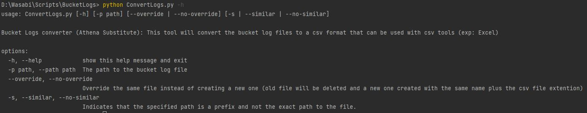

# Wasabi Bucket logs converter

This is a CLI tool that will convert the Wasabi log files to a csv format that will be opened in Excel or any other CSV viewer tool.

### Prerequisite

To run this tool, you will need Python installed

## Execution

to run this tool, you will need to run the following command:

```
python ConvertLogs.py (options)
```

To see the help page of this tool, run the following command:

```
python ConvertLogs.py -h
```



## Options:

This tool can convert one or several file at a time. You either specify the full path to a file, or a prefix to filter log files in the specified location:

1. Single file/ multiple files:
   To convert a single file, specify the path argument as follows

```
python ConvertLogs.py --path .\logs\log_file_example
```

to specify multiple files, add the `--similar` argument to your command as follows:

```
 python ConvertLogs.py --path .\logs\log_file_example --similar
```

 2. override the same file / create a new file:
You can use the `--override`flag to override the same file. If this flag isn't present, a new file will be created at the same location with the CSV extention and the current date:

```
 python ConvertLogs.py --path .\logs\log_file_example
```


```
 python ConvertLogs.py --path .\logs\folder1\log_aziz --override
```


## Note that multiple options can be used:

```
 python ConvertLogs.py --path .\logs\similar\public --similar --override
```


